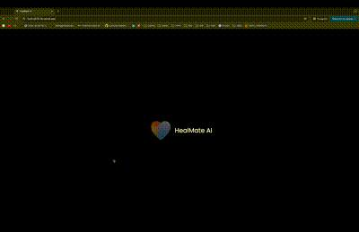

# HealMate Frontend

---

## Overview  
The frontend of HealMate is an interactive web application that provides users with a personalized and engaging experience. Built with cutting-edge web technologies, it combines 3D graphics with a responsive user interface to create an immersive environment for mental health support.
<p  align="center">



</p>

---

## Story and Motivation  
Our journey began with a desire to make mental health support more accessible and engaging. We noticed that many mental health apps lacked personalization and interactivity, which can be crucial for user engagement. By leveraging 3D graphics and allowing users to customize their virtual therapist avatar, we aimed to create a more personal and empathetic experience. Integrating custom assets from Adobe Explore Add-ons further enhanced the visual appeal, making the platform not just a tool, but a companion in the user's mental health journey. Planning for audio integration, we envision a future where the virtual therapist can communicate verbally, adding a layer of depth to user interactions.

---

## Tech Stack  
- **React**  
- **Vite**  
- **Three.js**  
- **@react-three** (fiber, drei, postprocessing, eslint-plugin)  
- **GLTF Transform**  
- **TailwindCSS**  
- **Leva**  
- **Zustand**  
- **PocketBase**  
- **Adobe Explore Add-ons**  
- **Docker and DockerHub**  
- **Terraform**  
- **GitHub Actions**

---

## Features  
- **Interactive 3D Virtual Therapist Customization**: Users can personalize the appearance of their virtual therapist using 3D models and custom assets.
- **Responsive User Interface**: Built with TailwindCSS for a seamless experience across all devices.
- **State Management**: Utilizes Zustand for efficient and easy-to-use state management.
- **Custom Assets**: Integrated stickers and icons from Adobe Explore Add-ons to enhance user engagement and visual storytelling.
- **Real-Time Communication**: Interfaces with the backend via WebSockets for real-time interactions.
- **Automated Deployment**: Deployed using Terraform and GitHub Actions, ensuring a smooth CI/CD pipeline.
- **Containerization**: Dockerized application for consistent deployment across environments.

---

## Installation  

1. **Clone the Repository**  

    ```bash
    git clone https://github.com/yourusername/healmate-frontend.git
    cd healmate-frontend
    ```

2. **Install Dependencies**  

    ```bash
    npm install
    ```

3. **Run the Application**  

    ```bash
    npm run dev
    ```

4. **Build for Production**  

    ```bash
    npm run build
    ```

---

## Deployment  
Deployment is automated using Terraform and GitHub Actions. The application is hosted on Vercel for reliable and fast performance.
